# C4 Level 3 — Components

> What are the major components inside the React Web App container?

```mermaid
C4Component
    title Component Diagram — React Web App

    Container_Boundary(app, "React Web App") {

        Component(app_root, "App.tsx", "React component", "Root. Owns auth state machine (phone → OTP → setup → app). Mounts tab shell or auth screens. Hides keyboard accessory bar on iOS.")

        Component(auth_ctx, "AuthContext", "React Context", "Provides user, session, profile, signOut, refreshProfile to entire tree. Fetches profile on session change.")

        Component(splash, "SplashScreen", "React component", "Animated intro. Shows 'The Gacker' wordmark and 'Never Doom.' motto on first load.")

        Component(bottom_nav, "BottomNav", "React component", "4-tab navigator: Log, Profile, Feed, Ganalytics. Drives activeTab state in App.tsx.")

        Container_Boundary(tabs, "Tab Pages") {
            Component(log_tab, "LogTab", "React page", "Daily entry form. Clean/red toggle, notes, SongPicker, LocationPicker, DatePickerSheet. Fires confetti or red flash on save. Calls entries.upsertEntry().")
            Component(profile_tab, "ProfileTab", "React page", "Own profile. CalendarView, stats row, follower/following sheets, notifications bell, settings gear.")
            Component(feed_tab, "FeedTab", "React page", "PullToRefresh wrapper around list of FeedCards. Subscribes to Realtime for live updates. Passes isActive prop to auto-close sheets on tab leave.")
            Component(analytics_tab, "GanalyticsTab", "React page", "Streak, clean days, red days, fire rate derived from entries.")
        }

        Container_Boundary(sheets, "Bottom Sheet Components") {
            Component(date_picker, "DatePickerSheet", "React component", "Month calendar for backdated entry. Always 6-row grid. Slide-up/down animation.")
            Component(entry_detail, "EntryDetailSheet", "React component", "Song, notes, timestamp for a tapped calendar day. Scrollable, 72vh fixed height.")
            Component(comments_sheet, "CommentsSheet", "React component", "Comment thread. Portaled to document.body to escape FeedCard stacking context.")
            Component(likes_sheet, "LikesSheet", "React component", "List of users who liked an entry.")
            Component(follow_list, "FollowListSheet", "React component", "Followers or following list. Min 40vh, scrollable.")
        }

        Container_Boundary(lib, "Library / Data Layer") {
            Component(entries_lib, "lib/entries.ts", "Module", "fetchEntries(), upsertEntry(), computeStats(). Owns Entry type definition.")
            Component(social_lib, "lib/social.ts", "Module", "getFeed(), getMyActivity(), toggleLike(), postComment(), followUser(), approveRequest(), searchUsers(), getFollowerCounts() etc.")
            Component(notif_lib, "lib/notifications.ts", "Module", "createNotification(), getNotifications(), markAllRead(), getUnreadCount().")
            Component(time_ago, "lib/timeAgo.ts", "Utility", "Converts ISO timestamp to '2m ago', '3d ago' etc. Used by FeedCard, CommentsSheet, EntryDetailSheet, NotificationsPage.")
            Component(validation, "lib/validation.ts", "Utility", "validateHandle(), validateName(), sanitizeHandle(), sanitizeName().")
        }

        Container_Boundary(pickers, "Picker Components") {
            Component(song_picker, "SongPicker", "React component", "Search field → calls itunes-search Edge Function → displays results → returns SongSelection.")
            Component(location_picker, "LocationPicker", "React component", "Uses Capacitor Geolocation → calls reverse-geocode Edge Function → returns LocationValue.")
        }

        Component(feed_card, "FeedCard", "React component", "Single feed item. Owns like toggle, opens CommentsSheet and LikesSheet. Closes sheets when isTabActive goes false.")
        Component(calendar_view, "CalendarView", "React component", "Month grid. Green/red dots per entry. Navigates backward. Calls onDayTap to open EntryDetailSheet.")
        Component(user_profile, "UserProfile", "React page", "Another user's profile. Shows stats/calendar only to self or accepted followers. Follow/unfollow button.")
        Component(settings_page, "SettingsPage", "React page", "Name, handle, avatar editing. Sign out. Delete account with confirmation dialog.")
        Component(supabase_client, "supabase client", "Supabase JS", "Singleton. Holds anon key + URL. Used by all lib modules and components for DB, auth, storage, functions calls.")
    }

    Rel(app_root, auth_ctx, "Provides")
    Rel(app_root, splash, "Renders on first load")
    Rel(app_root, bottom_nav, "Renders after auth")
    Rel(bottom_nav, log_tab, "activeTab === 'log'")
    Rel(bottom_nav, profile_tab, "activeTab === 'profile'")
    Rel(bottom_nav, feed_tab, "activeTab === 'feed'")
    Rel(bottom_nav, analytics_tab, "activeTab === 'analytics'")
    Rel(log_tab, date_picker, "Opens for backdated entry")
    Rel(log_tab, song_picker, "Opens for song tagging")
    Rel(log_tab, location_picker, "Opens for location pin")
    Rel(log_tab, entries_lib, "upsertEntry()")
    Rel(profile_tab, calendar_view, "Renders")
    Rel(profile_tab, entry_detail, "Opens on day tap")
    Rel(profile_tab, follow_list, "Opens followers/following")
    Rel(profile_tab, settings_page, "Opens")
    Rel(feed_tab, feed_card, "Renders list")
    Rel(feed_card, comments_sheet, "Opens")
    Rel(feed_card, likes_sheet, "Opens")
    Rel(feed_card, social_lib, "toggleLike(), postComment()")
    Rel(entries_lib, supabase_client, "queries entries table")
    Rel(social_lib, supabase_client, "queries follows, likes, comments, profiles, entries")
    Rel(notif_lib, supabase_client, "queries notifications table")
    Rel(social_lib, notif_lib, "createNotification() on like/comment/follow")
    Rel(settings_page, supabase_client, "functions.invoke('delete-account')")
```

## Component responsibilities summary

| Component | Owns |
|-----------|------|
| `App.tsx` | Auth state machine, tab routing, keyboard setup |
| `AuthContext` | Session, user object, profile object, sign-out |
| `lib/entries.ts` | All entry DB operations + stat calculation |
| `lib/social.ts` | Feed, follows, likes, comments, user search |
| `lib/notifications.ts` | Notification delivery and read state |
| `FeedCard` | Single post rendering, like/comment interaction |
| `CalendarView` | Month grid navigation and day tap |
| `CommentsSheet` | Comment thread (portaled to body) |
| All `*Sheet` components | Slide-up/down animation via `isClosing` state pattern |
