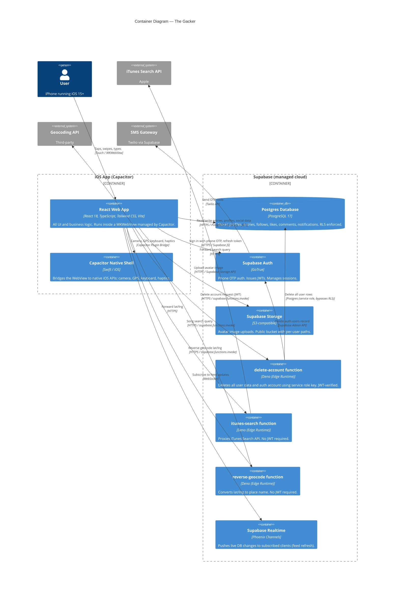

# C4 Level 2 — Containers

> What are the deployable/runnable units inside the system?

## Key design decisions

### Why no custom backend?
Supabase's PostgREST + RLS combination lets the app talk directly to the database safely. There's no business logic complex enough to require a dedicated API server. The three Edge Functions handle the only cases where a server-side step is unavoidable (service role key access, third-party API proxying).

### Why Edge Functions for iTunes and geocoding?
Keeping third-party API calls server-side means:
- API keys (if ever needed) never ship in the app bundle
- The app's network footprint is a single domain (Supabase)
- Rate limiting and caching can be added in one place later

### Why Capacitor instead of React Native?
The team is web-native. Capacitor lets 100% of the UI be standard React/TypeScript with zero native Swift code beyond the Capacitor scaffold. Native features (camera, GPS, keyboard, haptics) are accessed through well-maintained Capacitor plugins.
