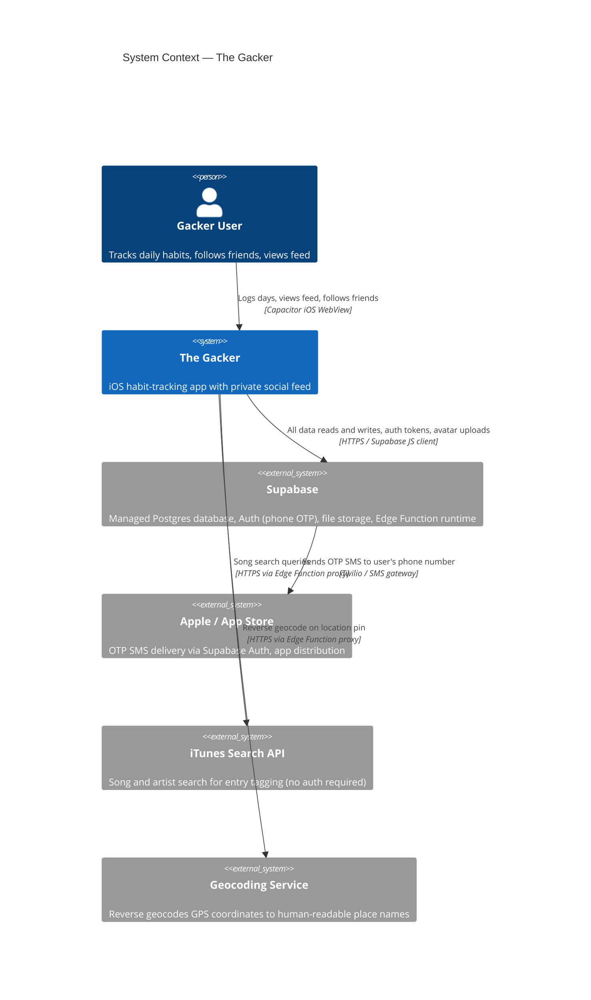

# C4 Level 1 — System Context

> Who uses the system and what external systems does it talk to?

## Notes

- The iOS app is a **WebView shell** — the UI is a React web app compiled and loaded inside a Capacitor native container. There is no separate native Swift UI.
- **All data flows through Supabase** — there is no custom API server. The app talks directly to Supabase's PostgREST endpoint using the anon key, with Row Level Security enforcing access control.
- iTunes Search and geocoding are proxied through **Supabase Edge Functions** so the app never calls those third-party APIs directly (keeps the network surface minimal and allows future auth/rate-limiting).
- SMS delivery for OTP is handled by **Supabase Auth's built-in Twilio integration** — the app never touches a phone number after submitting it.
